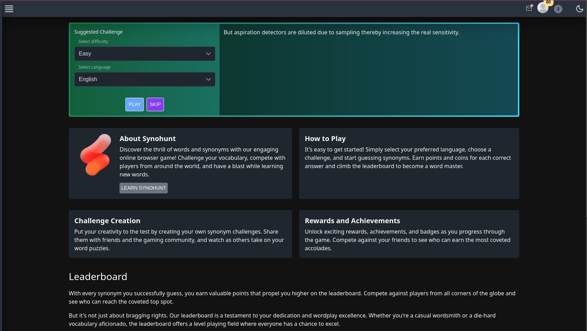

<p align="center">
<a href="https://www.synohunt.ru">
    
</a>
</p>

<br/>
<br/>


<a href="https://www.synohunt.ru">

</a>


- [Synohunt](#Synohunt)
    - [Table of Contents](#table-of-contents)
    - [About](#about)
    - [Technologies Used](#technologies-used)
    - [Features](#features)
    - [Getting Started](#getting-started)
        - [Prerequisites](#prerequisites)
        - [Installation](#installation)
    - [Usage](#usage)
    - [Screenshots](#screenshots)
    - [API Documentation](#api-documentation)
    - [Contributing](#contributing)
    - [License](#license)
    - [Acknowledgments](#acknowledgments)
    - [Contact](#contact)

# Synohunt

Welcome to **Synohunt**, a web application that allows users to create and solve challenges to find synonyms for words. It supports two languages and three difficulty levels.



## Getting started

**Clone the repository**

``
git clone https://github.com/rxMATTEO/Synohunt.git
``

**Install dependencies**
```
cd synohunt
npm i
```

**Configure your .env variables**

So, if you're looking for a development environment, create and set up `.env.development` and if you're building a production environment, set up `.env.production` 
by this template:

```
# GITHUB API (optional, it's your GitHub OAuth keys, but you can skip it if you don't have it)
GITHUB_CLIENT_PUBLIC=your_github_public_client_id
GITHUB_CLIENT_SECRET=your_github_client_secret

# SQL
DATABASE_URL=your_database_url
POSTGRES_URL=your_postgres_url
POSTGRES_PRISMA_URL=your_postgres_prisma_url
POSTGRES_URL_NON_POOLING=your_postgres_url_non_pooling
POSTGRES_USER=your_database_user
POSTGRES_HOST=your_database_host
POSTGRES_PASSWORD=your_database_password
POSTGRES_DATABASE=your_database_name

# AUTH
AUTH_ORIGIN=your_auth_origin           # in development usually it's your localhost at 3000 port
VITE_AUTH_ORIGIN=your_vite_auth_origin # in development usually it's your localhost at 3000 port
NEXTAUTH_URL=your_nextauth_url         # in development usually it's your localhost at 3000 port
AUTH_SECRET=your_auth_secret           # hashed string

# ANALYTICS
GOOGLE_TAG=your_google_tag to analytics (optional)

# Replace the placeholders (your_github_public_client_id, your_github_client_secret, etc.) with the actual values for your environment variables. Additionally, ensure that you keep this file secure and do not share sensitive information.
```

**Set Up Prisma**:

After configuring your database connection:
- Run migrations to create database tables:
```
npx prisma migrate dev
```

**Start the Development Server**

``
npm run dev
``

**After build**

Open your browser and visit `http://localhost:3000` to see Synohunt in action.

## Technologies Used

- **Nuxt 3**: The SSR framework for building this web application.
- **Vue 3**: The JavaScript framework for creating user interfaces.
- **Vite**: A fast and efficient build tool.
- **Typescript**: A typed superset of JavaScript for enhanced code quality.
- **Prisma**: A modern database toolkit for Node.js and TypeScript.
- **Tailwind CSS**: A utility-first CSS framework for building responsive designs.
- **PrimeVue**: A UI component library for Vue.js.
- **PrimeFlex**: A flexible CSS layout system for PrimeVue.
- **Pinia**: A state management solution for Vue 3.
- **RSA end-to-end encryption**: Used to secure user data and communication.

## Features

- Create and solve challenges to find synonyms for words.
- Support for two languages (add your supported languages here).
- Three difficulty levels (describe the levels here).

